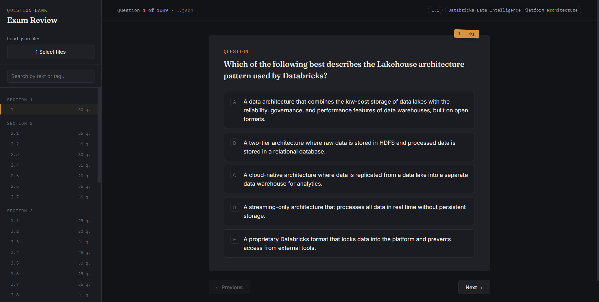

# Databricks Data Engineer Associate Exam Review

This repository contains a comprehensive set of practice questions and a web-based interactive quiz browser to help you prepare for the **Databricks Data Engineer Associate** certification.

## Features
- **Interactive Quiz Browser**: A lightweight, frontend-only application (`quiz.html`) that allows you to load JSON files containing questions, browse by section, and track your progress.
- **Categorized Question Bank**: Questions are logically grouped into JSON files corresponding to the official exam topics.

## Exam Topics Covered (Syllabus)

The question bank is structured strictly around the official exam syllabus:

### 1. Databricks Intelligence Platform
- **1.1** Databricks Data Intelligence Platform architecture (Lakehouse, control plane vs. data plane, workspace)
- **1.2** Delta Lake core concepts (ACID, time travel, transaction log, file format)
- **1.3** Unity Catalog architecture overview (metastore, catalog-schema-table hierarchy)
- **1.4** Compute services — types, characteristics, cost models (all-purpose, job, SQL warehouse, serverless)

### 2. Data Ingestion and Loading
- **2.1** Batch vs. streaming vs. incremental loading patterns
- **2.2** Auto Loader — schema enforcement & evolution (directory listing vs. file notification modes, cloudFiles syntax, checkpointing)
- **2.3** COPY INTO — syntax, idempotency, cloud storage (ADLS / S3 / GCS, FORMAT options, COPY_OPTIONS)
- **2.4** Lakeflow Connect — standard & managed connectors (configuration, supported sources, governance)
- **2.5** JDBC / ODBC ingestion in notebooks
- **2.6** Semi-structured & unstructured data ingestion (JSON, nested data, variant types)
- **2.7** Choosing the right ingestion method (decision matrix: volume, frequency, type, governance)

### 3. Data Transformation and Modeling
- **3.1** Medallion Architecture (Bronze / Silver / Gold) (purpose of each layer, design decisions)
- **3.2** Reading Bronze & cleaning to Silver (nulls, types)
- **3.3** DataFrame joins (inner, left, broadcast, cross, multiple keys, union)
- **3.4** Column & row manipulation (add, drop, rename, filter, split, explode arrays)
- **3.5** Aggregations & deduplication (groupBy, count, approx_count_distinct, mean, summary, dropDuplicates, window functions)
- **3.6** Spark tuning parameters (shuffle.partitions, parallelism, memory, autoBroadcastJoinThreshold)
- **3.7** Gold layer objects (materialized views, views, streaming tables, regular tables — when to use each)
- **3.8** Data quality checks & validation rules (expectations, constraints, DQ frameworks)

### 4. Working with Lakeflow Jobs
- **4.1** DAG-based task graphs & task dependencies
- **4.2** Common task types (notebook, SQL query, dashboard, pipeline tasks)
- **4.3** Control flow — retries, branching, looping
- **4.4** Trigger types (scheduled, file arrival, table update)
- **4.5** Time-based vs. data-driven trigger selection
- **4.6** Serverless compute for jobs

### 5. Implementing CI/CD
- **5.1** Databricks Git integration & Repos (branches, commits, pull requests, merge)
- **5.2** Declarative Automation Bundles (DABs) (structure, variables, overrides, dev/test/prod targets)
- **5.3** Databricks CLI (validate, deploy, manage assets, CI/CD workflows)
- **5.4** Promoting pipelines across environments (environment-specific config, bundle promotion)

### 6. Troubleshooting, Monitoring & Optimization
- **6.1** Lakeflow Jobs run history & performance trends
- **6.2** Monitoring with the Lakeflow Jobs UI (job statuses, DAG view, failure rates)
- **6.3** Spark UI — stage metrics, skew, shuffle, disk spill
- **6.4** Liquid Clustering & predictive optimization
- **6.5** Cluster diagnostics (startup failures, library conflicts, OOM errors)

### 7. Governance and Security
- **7.1** Managed vs. external tables (create, modify, delete, convert)
- **7.2** GRANT / REVOKE / DENY — users, groups, service principals
- **7.3** Column-level masking & row-level security
- **7.4** Unity Catalog ABAC policies
- **7.5** Lineage features in Unity Catalog

## How to Use

1. Clone or download this repository to your local machine.
2. Open `quiz.html` in your web browser.
3. Click on **Select files** in the sidebar on the left.
4. Select all the JSON files inside the `questions/` directory. (e.g., `1.json`, `2.1.json`, `3.1.json`, etc.).
5. The questions will be automatically loaded, sorted, and grouped by section. You can now navigate through them, select answers, and read the provided explanations.
